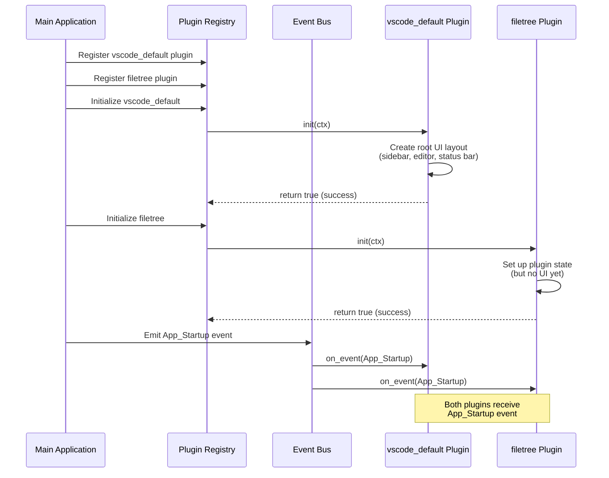
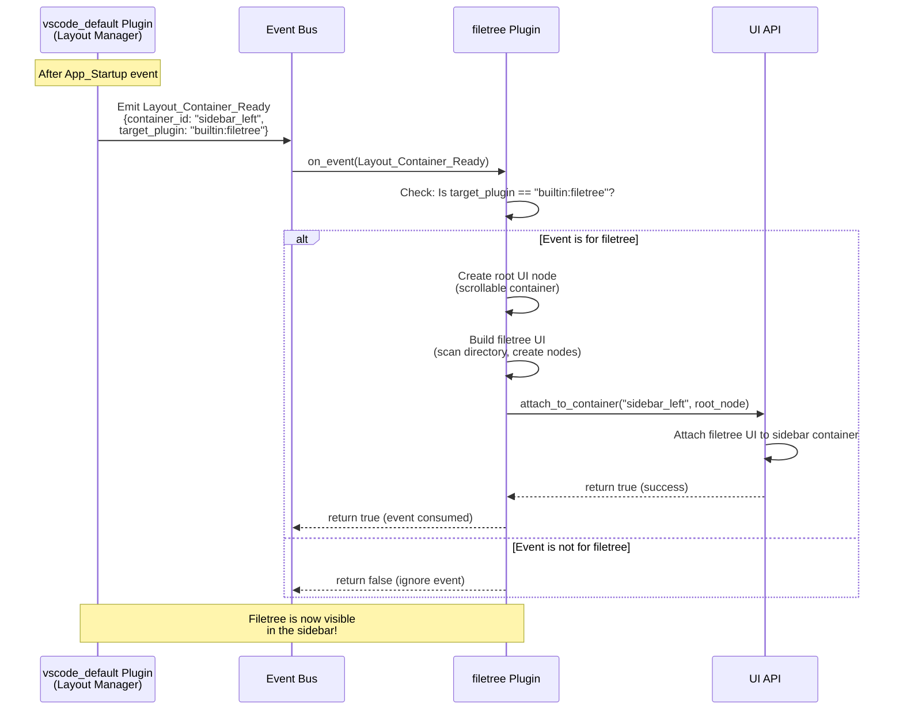
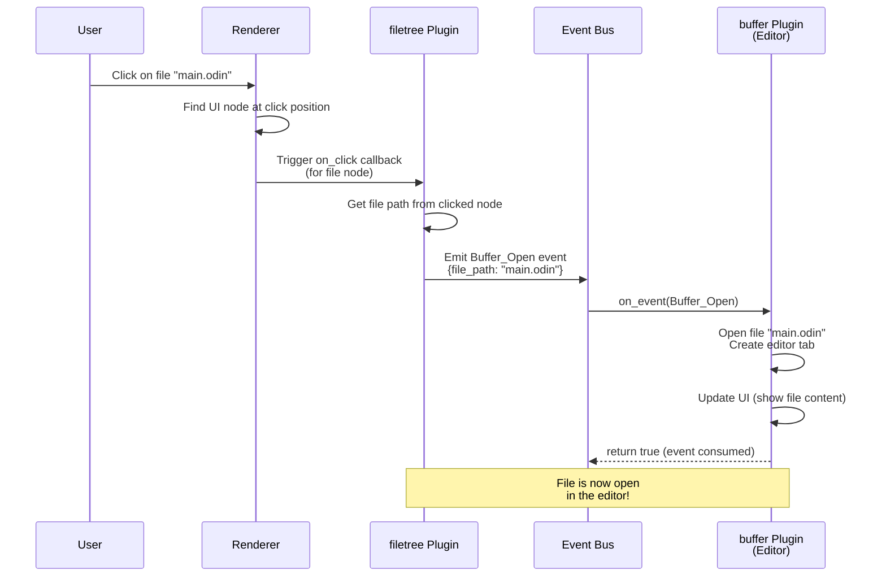
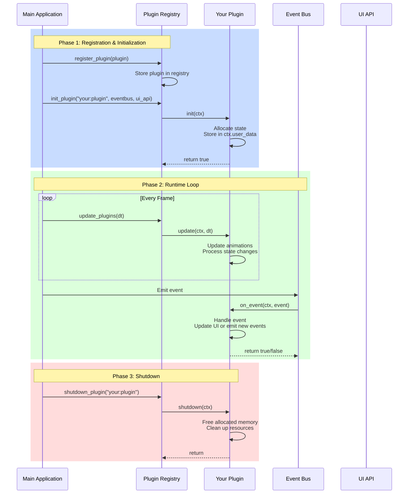
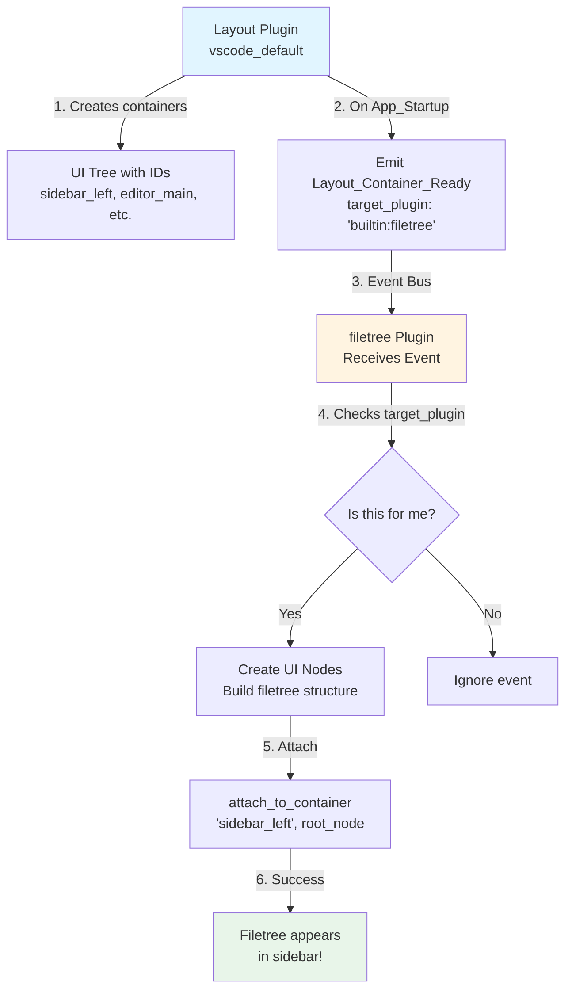
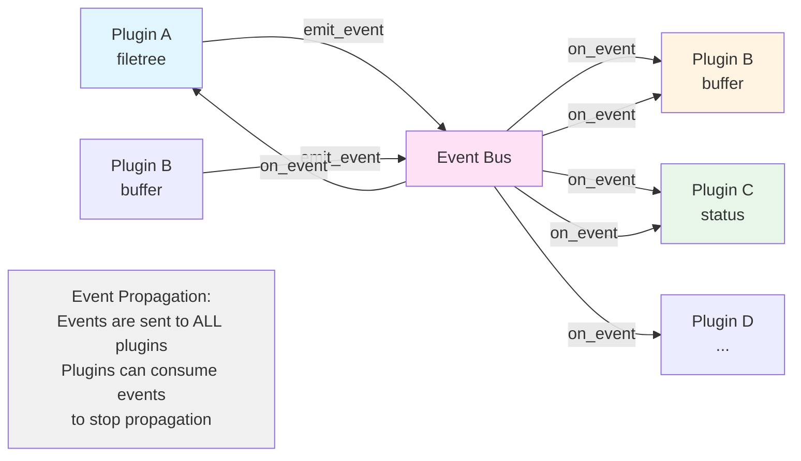

# Vessl Plugin API Documentation

## Overview

In Vessl, **everything is a plugin**. Plugins are first-class citizens that form the foundation of the IDE's architecture. Every piece of functionality—from the main layout to file trees, text editors, and terminal emulators—is implemented as a plugin. This design philosophy ensures extensibility, modularity, and a consistent development experience.

## What is a Plugin?

A plugin is a self-contained unit of functionality that implements the `PluginVTable` interface. Plugins have access to:

- **Event Bus**: Communicate with other plugins through a decoupled event system
- **UI API**: Manipulate the retained-mode UI DOM to render their interface
- **Plugin Registry**: Access to the plugin system for advanced interactions
- **Lifecycle Management**: Automatic initialization, updates, and cleanup

Plugins are **passive** regarding their placement in the UI. They wait for layout events from a "main" plugin (typically `builtin:vscode_default`) that dictates where they should render.

## Visual Guide: How Plugins Communicate

The following diagrams illustrate how plugins interact with the core application and each other. These use the **filetree plugin** as a concrete example to make the concepts easier to understand.

### 1. Plugin Initialization Sequence

This diagram shows what happens when the application starts and plugins are loaded:



### 2. Layout Handshake Sequence (The Filetree Example)

This is the crucial "handshake" process where the layout plugin tells other plugins where to render. The filetree plugin waits passively until invited:



### 3. User Interaction Flow (Clicking a File)

This shows what happens when a user clicks a file in the filetree, demonstrating plugin-to-plugin communication:



### 4. Complete Lifecycle Overview

This diagram shows the complete lifecycle of a plugin from registration to shutdown:



## Plugin Structure

Every plugin must implement four core procedures:

```odin
PluginVTable :: struct {
    init:      proc(ctx: ^PluginContext) -> bool,
    update:    proc(ctx: ^PluginContext, dt: f32),
    shutdown:  proc(ctx: ^PluginContext),
    on_event:  proc(ctx: ^PluginContext, event: ^Event) -> bool,
}
```

### Lifecycle

1. **Registration**: Plugin is registered with the `PluginRegistry`
2. **Initialization**: `init` is called when the plugin is loaded
3. **Runtime**: `update` is called every frame with delta time
4. **Event Handling**: `on_event` receives all events from the Event Bus
5. **Shutdown**: `shutdown` is called when the plugin is unloaded

## Plugin Context

The `PluginContext` provides everything a plugin needs:

```odin
PluginContext :: struct {
    eventbus: ^EventBus,
    plugin_id: string,
    user_data: rawptr,
    allocator: mem.Allocator,
    ui_api: rawptr,        // ^UIPluginAPI (cast when needed)
    plugin_registry: rawptr, // ^PluginRegistry (cast when needed)
    ctx: rawptr,
}
```

- **`user_data`**: Store your plugin's state here
- **`allocator`**: Use this for all memory allocations
- **`ui_api`**: Cast to `^UIPluginAPI` to manipulate the UI
- **`eventbus`**: Emit and receive events
- **`plugin_registry`**: Access other plugins (advanced usage)

## Common Tasks

### 1. Creating a Basic Plugin

```odin
package my_plugin

import core "../../core"
import ui "../../ui"
import "core:mem"

MyPluginState :: struct {
    // Your plugin's state
}

my_plugin_init :: proc(ctx: ^core.PluginContext) -> bool {
    state := new(MyPluginState, ctx.allocator)
    ctx.user_data = state
    return true
}

my_plugin_update :: proc(ctx: ^core.PluginContext, dt: f32) {
    // Called every frame
}

my_plugin_shutdown :: proc(ctx: ^core.PluginContext) {
    state := cast(^MyPluginState)ctx.user_data
    if state != nil {
        free(state)
    }
}

my_plugin_on_event :: proc(ctx: ^core.PluginContext, event: ^core.Event) -> bool {
    // Handle events
    return false
}

get_vtable :: proc() -> core.PluginVTable {
    return core.PluginVTable {
        init = my_plugin_init,
        update = my_plugin_update,
        shutdown = my_plugin_shutdown,
        on_event = my_plugin_on_event,
    }
}
```

### 2. Creating UI Elements

Plugins create UI nodes and attach them to containers:

```odin
// Create a container
container := ui.create_node(ui.ElementID("my_container"), .Container, ctx.allocator)
container.style.width = ui.SIZE_FULL
container.style.height = ui.sizing_px(200)
container.style.color = {0.2, 0.2, 0.2, 1.0}
container.style.layout_dir = .TopDown

// Create text
text_node := ui.create_node(ui.ElementID("my_text"), .Text, ctx.allocator)
text_node.text_content = "Hello, Vessl!"
text_node.style.color = {1.0, 1.0, 1.0, 1.0}

// Add text to container
ui.add_child(container, text_node)
```

### 3. Attaching to Layout Containers

Plugins wait for `Layout_Container_Ready` events to know where to render. Here's a visual representation of the process:



**Key Points:**
- Plugins are **passive** - they don't decide where to render
- The layout plugin **invites** other plugins to specific containers
- Each plugin checks if the event is meant for them before responding
- Only one plugin should attach to each container

Now, here's the code implementation:

```odin
my_plugin_on_event :: proc(ctx: ^core.PluginContext, event: ^core.Event) -> bool {
    #partial switch event.type {
    case .Layout_Container_Ready:
        #partial switch payload in event.payload {
        case core.EventPayload_Layout:
            if payload.target_plugin != "my:plugin" do return false
            
            // Create your UI
            root := ui.create_node(ui.ElementID("my_root"), .Container, ctx.allocator)
            // ... build UI tree ...
            
            // Attach to the container
            ui_api_ptr := cast(^ui.UIPluginAPI)ctx.ui_api
            ui.attach_to_container(ui_api_ptr, payload.container_id, root)
            return true
        }
    }
    return false
}
```

### 4. Handling Click Events

Set callbacks on UI nodes for interactivity:

```odin
// Create callback context
callback_ctx := new(struct {
    state: ^MyPluginState,
    data: string,
}, ctx.allocator)
callback_ctx.state = state
callback_ctx.data = "some data"

// Define callback
click_handler := proc(ctx: rawptr) {
    cb_ctx := cast(^struct { state: ^MyPluginState, data: string })ctx
    // Handle click
}

// Attach to node
button_node.on_click = click_handler
button_node.callback_ctx = callback_ctx
button_node.cursor = .Hand // Show hand cursor on hover
```

### 5. Emitting Events

Plugins communicate through the Event Bus. The Event Bus acts as a central message router that delivers events to all subscribed plugins:



**Event Flow Rules:**
- Events are **broadcast** to all plugins (not targeted)
- Plugins check event type and payload to decide if they should handle it
- Returning `true` from `on_event` **consumes** the event (stops propagation)
- Returning `false` allows other plugins to see the event
- Events are short-lived (allocated in an arena, cleaned up automatically)

Here's how to emit events:

```odin
// Emit a file open event
payload := core.EventPayload_File {
    path = "/path/to/file.txt",
}
core.emit_event_typed(ctx.eventbus, .Buffer_Open, payload)

// Emit a custom event
custom_payload := core.EventPayload_Custom {
    name = "my_custom_event",
    data = rawptr(my_data),
}
core.emit_event_typed(ctx.eventbus, .Custom_Signal, custom_payload)
```

### 6. Responding to Events

Handle events in `on_event`:

```odin
my_plugin_on_event :: proc(ctx: ^core.PluginContext, event: ^core.Event) -> bool {
    #partial switch event.type {
    case .Buffer_Open:
        #partial switch payload in event.payload {
        case core.EventPayload_Buffer:
            // Open the file
            open_file(payload.file_path)
            return true // Consume the event
        }
    case .Window_Resize:
        // Handle window resize
        return false // Don't consume, let others see it
    }
    return false
}
```

### 7. Sizing UI Elements

Use the flexible sizing system:

```odin
// Fixed pixel size
node.style.width = ui.sizing_px(200)
node.style.height = ui.sizing_px(100)

// Percentage (0.0 to 1.0, where 1.0 = 100%)
node.style.width = ui.sizing_pct(0.5) // 50% width

// Grow to fill available space
node.style.width = ui.sizing_grow()

// Fit to content
node.style.height = ui.sizing_fit()

// Full size (100%)
node.style.width = ui.SIZE_FULL
```

### 8. Layout Directions

Control how children are arranged:

```odin
// Vertical stack (top to bottom)
container.style.layout_dir = .TopDown

// Horizontal stack (left to right)
container.style.layout_dir = .LeftRight
```

### 9. Styling

Set colors, padding, and gaps:

```odin
// RGBA color (0.0 to 1.0)
node.style.color = {0.2, 0.2, 0.2, 1.0} // Dark gray

// Padding: {top, right, bottom, left}
node.style.padding = {8, 8, 8, 8}

// Gap between children
node.style.gap = 4
```

### 10. Scrollable Containers

Enable clipping for scrollable areas:

```odin
container.style.clip_vertical = true
container.style.clip_horizontal = false
```

## Best Practices

1. **Memory Management**: Always use `ctx.allocator` for allocations. Store state in `ctx.user_data`.

2. **Event Consumption**: Return `true` from `on_event` only if you've fully handled the event and want to stop propagation.

3. **UI Node IDs**: Use unique IDs for all UI nodes. Consider prefixing with your plugin name.

4. **Layout Handshake**: Don't create UI until you receive a `Layout_Container_Ready` event targeting your plugin.

5. **Thread Safety**: The Event Bus and Plugin Registry are thread-safe, but UI manipulation should happen on the main thread.

6. **Cleanup**: Free all allocated resources in `shutdown`. UI nodes are cleaned up automatically by the renderer.

7. **String Cloning**: Clone strings when storing them in persistent data structures (plugin IDs, file paths, etc.).

## Plugin Types

### Layout Plugins

Layout plugins (like `builtin:vscode_default`) create the main UI structure and emit `Layout_Container_Ready` events to invite other plugins to attach.

### Feature Plugins

Feature plugins (like `builtin:filetree`, `builtin:buffer`) wait for layout events and attach their UI to designated containers.

### Utility Plugins

Utility plugins may not have UI but provide services through events (e.g., a git integration plugin that emits status updates).

## Event Types

- **`App_Startup`**: Emitted when the application starts
- **`App_Shutdown`**: Emitted when the application shuts down
- **`Window_Resize`**: Emitted when the window is resized
- **`Window_File_Drop`**: Emitted when files are dropped on the window
- **`Layout_Container_Ready`**: Emitted by layout plugins to signal a container is ready
- **`Buffer_Open`**: Emitted when a file should be opened
- **`Buffer_Save`**: Emitted when a buffer should be saved
- **`Cursor_Move`**: Emitted when the cursor moves in an editor
- **`Custom_Signal`**: For custom plugin-to-plugin communication

## Example: Complete Plugin

Here's a minimal complete plugin that displays a status message:

```odin
package status

import core "../../core"
import ui "../../ui"
import "core:mem"
import "core:strings"

StatusState :: struct {
    root_node: ^ui.UINode,
    message: string,
    attached: bool,
}

status_init :: proc(ctx: ^core.PluginContext) -> bool {
    state := new(StatusState, ctx.allocator)
    state.message = "Ready"
    state.attached = false
    ctx.user_data = state
    return true
}

status_update :: proc(ctx: ^core.PluginContext, dt: f32) {
    // Update logic (animations, etc.)
}

status_shutdown :: proc(ctx: ^core.PluginContext) {
    state := cast(^StatusState)ctx.user_data
    if state != nil {
        delete(state.message)
        free(state)
    }
}

status_on_event :: proc(ctx: ^core.PluginContext, event: ^core.Event) -> bool {
    state := cast(^StatusState)ctx.user_data
    if state == nil do return false

    #partial switch event.type {
    case .Layout_Container_Ready:
        if state.attached do return false
        
        #partial switch payload in event.payload {
        case core.EventPayload_Layout:
            if payload.target_plugin != "builtin:status" do return false
            
            // Create status bar UI
            root := ui.create_node(ui.ElementID("status_root"), .Container, ctx.allocator)
            root.style.width = ui.SIZE_FULL
            root.style.height = ui.sizing_px(30)
            root.style.color = {0.15, 0.15, 0.15, 1.0}
            root.style.layout_dir = .LeftRight
            root.style.padding = {4, 8, 4, 8}
            
            text := ui.create_node(ui.ElementID("status_text"), .Text, ctx.allocator)
            text.text_content = strings.clone(state.message, ctx.allocator)
            text.style.color = {0.9, 0.9, 0.9, 1.0}
            
            ui.add_child(root, text)
            state.root_node = root
            
            // Attach to container
            ui_api_ptr := cast(^ui.UIPluginAPI)ctx.ui_api
            if ui.attach_to_container(ui_api_ptr, payload.container_id, root) {
                state.attached = true
                return true
            }
        }
    }
    return false
}

get_vtable :: proc() -> core.PluginVTable {
    return core.PluginVTable {
        init = status_init,
        update = status_update,
        shutdown = status_shutdown,
        on_event = status_on_event,
    }
}
```

## Conclusion

Plugins in Vessl are powerful, first-class citizens that can create rich UI, handle events, and extend the IDE's functionality. By following the plugin API and best practices, you can build anything from simple utilities to complex editors and integrations.

