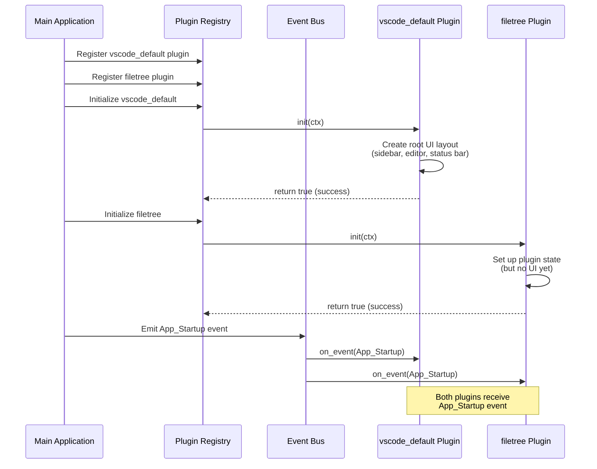
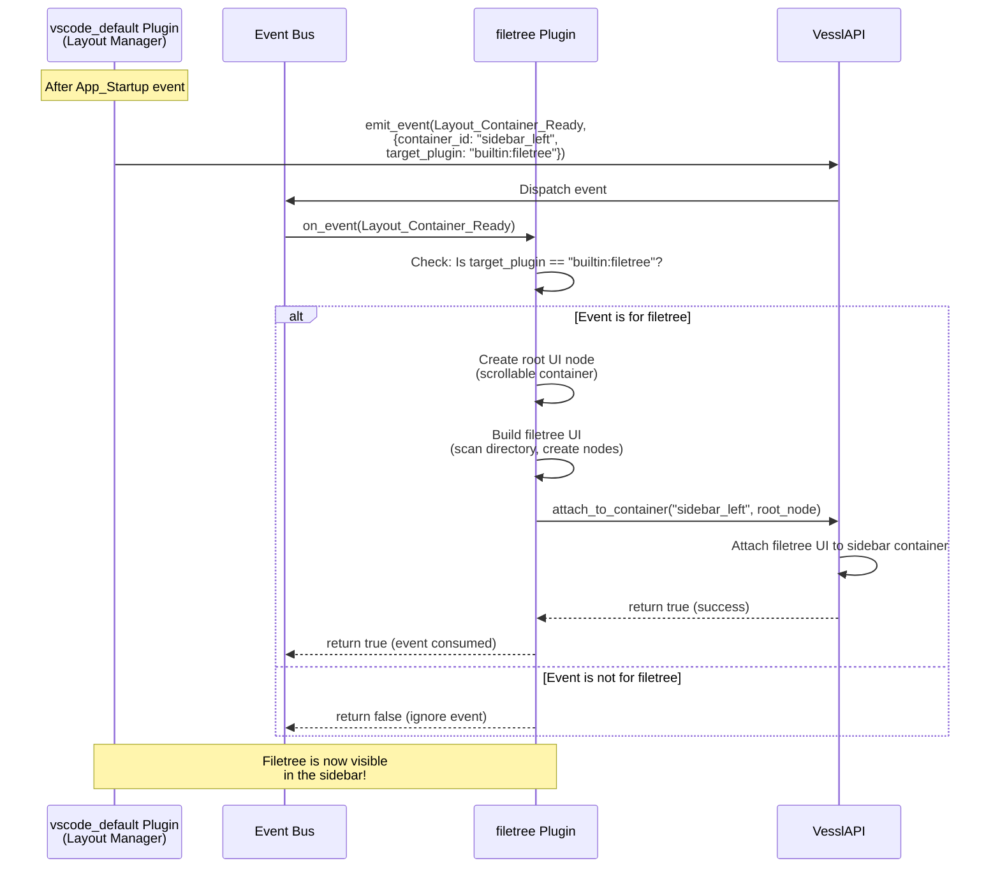
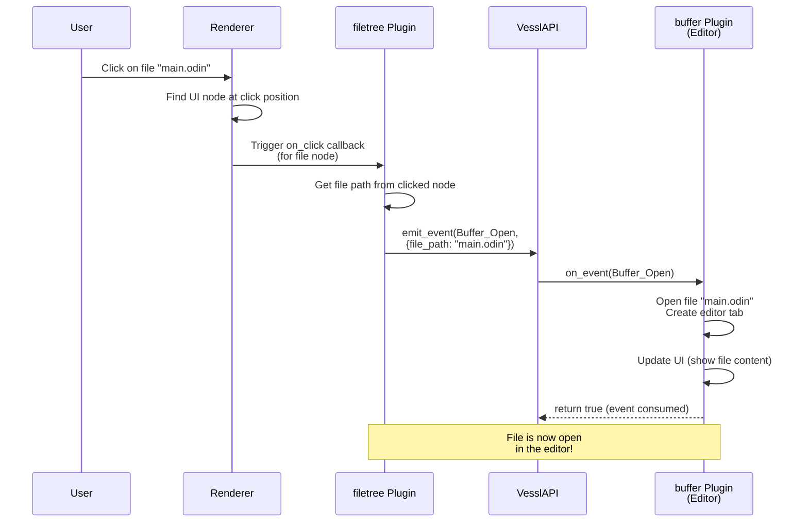
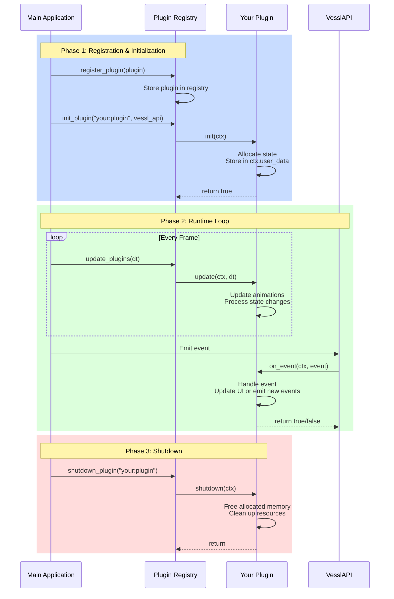
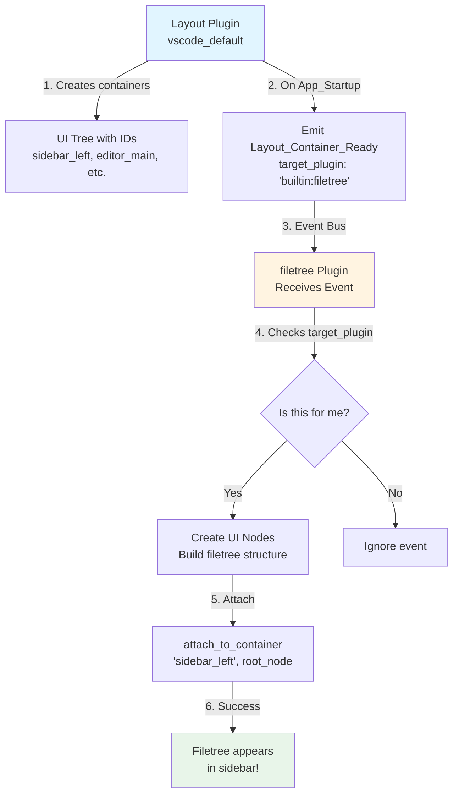
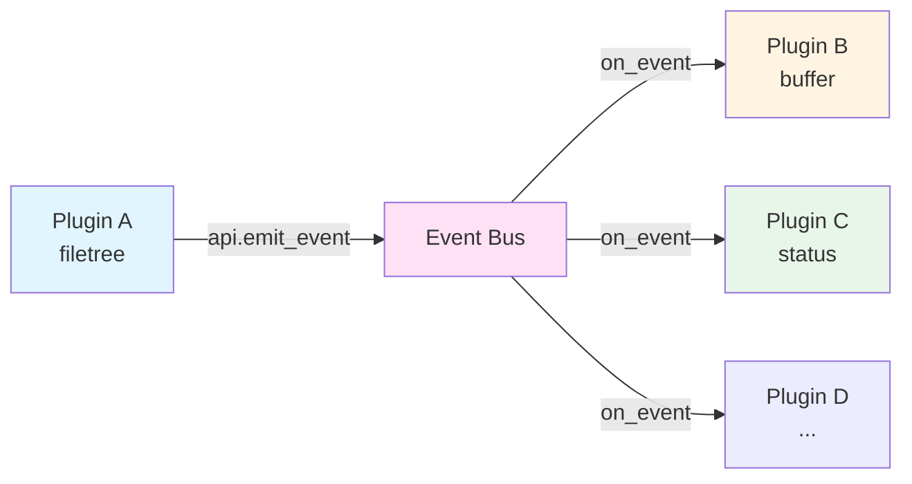

# Vessl Plugin API Documentation

## Overview

In Vessl, **everything is a plugin**. Plugins are first-class citizens that form the foundation of the IDE's architecture. Every piece of functionality—from the main layout to file trees, text editors, and terminal emulators—is implemented as a plugin. This design philosophy ensures extensibility, modularity, and a consistent development experience.

## API Architecture

Plugins interact with the Vessl IDE through a clean, thin API layer. The key principle is:

> **Plugins should only import the `api` package (and the Odin standard library).**

This ensures:
- **Stability**: The API provides a stable interface that doesn't change with internal refactors
- **Decoupling**: Plugins don't depend on internal implementation details
- **Performance**: The API is a thin VTable-based layer with minimal overhead
- **Future-proofing**: Enables potential WASM/JavaScript plugin support

```
┌─────────────────────────────────────────────────────────────┐
│                         Plugin                               │
│                    (imports: api, core:*)                    │
└─────────────────────────────────────────────────────────────┘
                              │
                              ▼
┌─────────────────────────────────────────────────────────────┐
│                        api package                           │
│    • Types (Event, UINode, Style, etc.)                     │
│    • Helper functions (sizing_px, create_node, etc.)        │
│    • VesslAPI VTable (emit_event, set_root_node, etc.)     │
└─────────────────────────────────────────────────────────────┘
                              │
                              ▼
┌─────────────────────────────────────────────────────────────┐
│                    Internal Packages                         │
│              (core, ui - not imported by plugins)           │
└─────────────────────────────────────────────────────────────┘
```

## What is a Plugin?

A plugin is a self-contained unit of functionality that implements the `PluginVTable` interface. Plugins have access to:

- **VesslAPI**: A VTable providing all system functions (events, UI, shortcuts, platform)
- **Helper Functions**: Pure functions for creating UI nodes, sizing, etc.
- **Type System**: All shared types (Events, UINode, Style, etc.)
- **Standard Library**: Full access to Odin's standard library (`core:*`)

Plugins are **passive** regarding their placement in the UI. They wait for layout events from a "main" plugin (typically `builtin:vscode_default`) that dictates where they should render.

## Visual Guide: How Plugins Communicate

The following diagrams illustrate how plugins interact with the core application and each other. These use the **filetree plugin** as a concrete example to make the concepts easier to understand.

### 1. Plugin Initialization Sequence

This diagram shows what happens when the application starts and plugins are loaded:



### 2. Layout Handshake Sequence (The Filetree Example)

This is the crucial "handshake" process where the layout plugin tells other plugins where to render. The filetree plugin waits passively until invited:



### 3. User Interaction Flow (Clicking a File)

This shows what happens when a user clicks a file in the filetree, demonstrating plugin-to-plugin communication:



### 4. Complete Lifecycle Overview

This diagram shows the complete lifecycle of a plugin from registration to shutdown:



## Plugin Structure

Every plugin must implement four core procedures:

```odin
PluginVTable :: struct {
    init:      proc(ctx: ^PluginContext) -> bool,
    update:    proc(ctx: ^PluginContext, dt: f32),
    shutdown:  proc(ctx: ^PluginContext),
    on_event:  proc(ctx: ^PluginContext, event: ^Event) -> bool,
}
```

### Lifecycle

1. **Registration**: Plugin is registered with the `PluginRegistry`
2. **Initialization**: `init` is called when the plugin is loaded
3. **Runtime**: `update` is called every frame with delta time
4. **Event Handling**: `on_event` receives all events from the Event Bus
5. **Shutdown**: `shutdown` is called when the plugin is unloaded

## Plugin Context

The `PluginContext` provides everything a plugin needs:

```odin
PluginContext :: struct {
    plugin_id: string,
    user_data: rawptr,
    allocator: mem.Allocator,
    api:       ^VesslAPI,  // The API VTable for calling system functions
}
```

- **`plugin_id`**: Unique identifier for this plugin
- **`user_data`**: Store your plugin's state here
- **`allocator`**: Use this for all memory allocations
- **`api`**: The VesslAPI VTable for all system interactions

## VesslAPI VTable

The `VesslAPI` struct provides all system functions as a VTable:

```odin
VesslAPI :: struct {
    // Event System
    emit_event:          proc(ctx: ^PluginContext, type: EventType, payload: EventPayload) -> (^Event, bool),
    dispatch_event:      proc(ctx: ^PluginContext, event: ^Event) -> bool,

    // UI System
    set_root_node:       proc(ctx: ^PluginContext, root: ^UINode),
    find_node_by_id:     proc(ctx: ^PluginContext, id: ElementID) -> ^UINode,
    attach_to_container: proc(ctx: ^PluginContext, container_id: string, node: ^UINode) -> bool,

    // Keyboard Shortcuts
    register_shortcut:   proc(ctx: ^PluginContext, key: i32, modifiers: KeyModifier, event_name: string) -> bool,
    unregister_shortcuts: proc(ctx: ^PluginContext),

    // Platform Features
    show_folder_dialog:  proc(ctx: ^PluginContext, default_location: string),
}
```

### Convenience Wrappers

The `api` package provides convenience wrappers that make calling VTable functions easier:

```odin
// Instead of:
ctx.api.emit_event(ctx, .Buffer_Open, payload)

// You can write:
api.emit_event(ctx, .Buffer_Open, payload)
```

## Common Tasks

### 1. Creating a Basic Plugin

```odin
package my_plugin

import api "../../api"
import "core:mem"

MyPluginState :: struct {
    // Your plugin's state
}

my_plugin_init :: proc(ctx: ^api.PluginContext) -> bool {
    state := new(MyPluginState, ctx.allocator)
    ctx.user_data = state
    return true
}

my_plugin_update :: proc(ctx: ^api.PluginContext, dt: f32) {
    // Called every frame
}

my_plugin_shutdown :: proc(ctx: ^api.PluginContext) {
    state := cast(^MyPluginState)ctx.user_data
    if state != nil {
        free(state)
    }
}

my_plugin_on_event :: proc(ctx: ^api.PluginContext, event: ^api.Event) -> bool {
    // Handle events
    return false
}

get_vtable :: proc() -> api.PluginVTable {
    return api.PluginVTable {
        init = my_plugin_init,
        update = my_plugin_update,
        shutdown = my_plugin_shutdown,
        on_event = my_plugin_on_event,
    }
}
```

### 2. Creating UI Elements

Plugins create UI nodes using helper functions from the `api` package:

```odin
// Create a container
container := api.create_node(api.ElementID("my_container"), .Container, ctx.allocator)
container.style.width = api.SIZE_FULL
container.style.height = api.sizing_px(200)
container.style.color = {0.2, 0.2, 0.2, 1.0}
container.style.layout_dir = .TopDown

// Create text
text_node := api.create_node(api.ElementID("my_text"), .Text, ctx.allocator)
text_node.text_content = "Hello, Vessl!"
text_node.style.color = {1.0, 1.0, 1.0, 1.0}

// Add text to container
api.add_child(container, text_node)
```

### 3. Attaching to Layout Containers

Plugins wait for `Layout_Container_Ready` events to know where to render. Here's a visual representation of the process:



**Key Points:**
- Plugins are **passive** - they don't decide where to render
- The layout plugin **invites** other plugins to specific containers
- Each plugin checks if the event is meant for them before responding
- Only one plugin should attach to each container

Now, here's the code implementation:

```odin
my_plugin_on_event :: proc(ctx: ^api.PluginContext, event: ^api.Event) -> bool {
    #partial switch event.type {
    case .Layout_Container_Ready:
        #partial switch payload in event.payload {
        case api.EventPayload_Layout:
            if payload.target_plugin != "my:plugin" do return false
            
            // Create your UI
            root := api.create_node(api.ElementID("my_root"), .Container, ctx.allocator)
            // ... build UI tree ...
            
            // Attach to the container
            api.attach_to_container(ctx, payload.container_id, root)
            return true
        }
    }
    return false
}
```

### 4. Handling Click Events

Set callbacks on UI nodes for interactivity:

```odin
// Create callback context
callback_ctx := new(struct {
    state: ^MyPluginState,
    data: string,
}, ctx.allocator)
callback_ctx.state = state
callback_ctx.data = "some data"

// Define callback
click_handler := proc(ctx: rawptr) {
    cb_ctx := cast(^struct { state: ^MyPluginState, data: string })ctx
    // Handle click
}

// Attach to node
button_node.on_click = click_handler
button_node.callback_ctx = callback_ctx
button_node.cursor = .Hand // Show hand cursor on hover
```

### 5. Emitting Events

Plugins communicate through the Event Bus using the VesslAPI:



**Event Flow Rules:**
- Events are **broadcast** to all plugins (not targeted)
- Plugins check event type and payload to decide if they should handle it
- Returning `true` from `on_event` **consumes** the event (stops propagation)
- Returning `false` allows other plugins to see the event
- Events are short-lived (allocated in an arena, cleaned up automatically)

Here's how to emit events:

```odin
// Emit a buffer open event
payload := api.EventPayload_Buffer {
    file_path = "/path/to/file.txt",
    buffer_id = "buffer_1",
}
api.emit_event(ctx, .Buffer_Open, payload)

// Emit a custom event
custom_payload := api.EventPayload_Custom {
    name = "my_custom_event",
    data = rawptr(my_data),
}
api.emit_event(ctx, .Custom_Signal, custom_payload)
```

### 6. Responding to Events

Handle events in `on_event`:

```odin
my_plugin_on_event :: proc(ctx: ^api.PluginContext, event: ^api.Event) -> bool {
    #partial switch event.type {
    case .Buffer_Open:
        #partial switch payload in event.payload {
        case api.EventPayload_Buffer:
            // Open the file
            open_file(payload.file_path)
            return true // Consume the event
        }
    case .Window_Resize:
        // Handle window resize
        return false // Don't consume, let others see it
    }
    return false
}
```

### 7. Sizing UI Elements

Use the flexible sizing system:

```odin
// Fixed pixel size
node.style.width = api.sizing_px(200)
node.style.height = api.sizing_px(100)

// Percentage (0.0 to 1.0, where 1.0 = 100%)
node.style.width = api.sizing_pct(0.5) // 50% width

// Grow to fill available space
node.style.width = api.sizing_grow()

// Fit to content
node.style.height = api.sizing_fit()

// Full size (100%)
node.style.width = api.SIZE_FULL
```

### 8. Layout Directions

Control how children are arranged:

```odin
// Vertical stack (top to bottom)
container.style.layout_dir = .TopDown

// Horizontal stack (left to right)
container.style.layout_dir = .LeftRight
```

### 9. Styling

Set colors, padding, and gaps:

```odin
// RGBA color (0.0 to 1.0)
node.style.color = {0.2, 0.2, 0.2, 1.0} // Dark gray

// Padding: {left, top, right, bottom}
node.style.padding = {8, 8, 8, 8}

// Gap between children
node.style.gap = 4
```

### 10. Scrollable Containers

Enable clipping for scrollable areas:

```odin
container.style.clip_vertical = true
container.style.clip_horizontal = false
```

## Keyboard Shortcuts

Plugins can register keyboard shortcuts that trigger named events. This enables a powerful decoupled design: one plugin registers a shortcut, and any plugin (including a different one) can handle the resulting event.

### How Keyboard Shortcuts Work

```mermaid
sequenceDiagram
    participant Plugin A as Plugin A<br/>(Registers Shortcut)
    participant API as VesslAPI
    participant Main as Main Event Loop
    participant EventBus as Event Bus
    participant Plugin B as Plugin B<br/>(Handles Event)
    
    Note over Plugin A,API: During Plugin Init
    Plugin A->>API: register_shortcut(Ctrl+O, "open_file")
    
    Note over Main,EventBus: User presses Ctrl+O
    Main->>API: find_shortcut(key='o', modifiers={Ctrl})
    API-->>Main: "open_file"
    Main->>EventBus: emit Custom_Signal<br/>{name: "open_file"}
    EventBus->>Plugin B: on_event(Custom_Signal)
    Plugin B->>Plugin B: Handle "open_file" event
    Plugin B-->>EventBus: return true (consumed)
```

### Registering Shortcuts

Register shortcuts during your plugin's `init` procedure using the VesslAPI:

```odin
my_plugin_init :: proc(ctx: ^api.PluginContext) -> bool {
    // ... other initialization ...

    // Define the key (SDL keycode - use lowercase letter)
    KEY_S :: 's'
    
    // Register Ctrl+S for save (Windows/Linux)
    api.register_shortcut(ctx, KEY_S, {.Ctrl}, "save_buffer")
    
    // Register Cmd+S for save (macOS)
    api.register_shortcut(ctx, KEY_S, {.Cmd}, "save_buffer")
    
    // Register Ctrl+Shift+S for save all
    api.register_shortcut(ctx, KEY_S, {.Ctrl, .Shift}, "save_all_buffers")
    
    return true
}
```

### Available Modifiers

The `KeyModifier` type is a bit set with **platform-specific** modifier names:

```odin
KeyModifierFlag :: enum {
    // Windows/Linux modifiers
    Ctrl,     // Control key (primary modifier on Windows/Linux)
    Alt,      // Alt key
    Meta,     // Windows key (rarely used in shortcuts)
    
    // macOS modifiers
    Cmd,      // Command key ⌘ (primary modifier on macOS)
    Opt,      // Option key ⌥ (equivalent to Alt)
    CtrlMac,  // Control key on Mac ⌃ (rarely used, distinct from Cmd)
    
    // Shared
    Shift,    // Shift key (all platforms)
}
```

### Platform Considerations

To support all platforms, register shortcuts with the appropriate platform-specific modifiers:

```odin
KEY_O :: 'o'
KEY_S :: 's'

// "Open File" shortcut
api.register_shortcut(ctx, KEY_O, {.Ctrl}, "open_file")  // Windows/Linux: Ctrl+O
api.register_shortcut(ctx, KEY_O, {.Cmd}, "open_file")   // macOS: Cmd+O

// "Save All" shortcut with Shift
api.register_shortcut(ctx, KEY_S, {.Ctrl, .Shift}, "save_all")  // Windows/Linux: Ctrl+Shift+S
api.register_shortcut(ctx, KEY_S, {.Cmd, .Shift}, "save_all")   // macOS: Cmd+Shift+S
```

### Handling Shortcut Events

When a shortcut is triggered, it emits a `Custom_Signal` event:

```odin
my_plugin_on_event :: proc(ctx: ^api.PluginContext, event: ^api.Event) -> bool {
    #partial switch event.type {
    case .Custom_Signal:
        #partial switch payload in event.payload {
        case api.EventPayload_Custom:
            if payload.name == "save_buffer" {
                save_current_buffer()
                return true
            }
            if payload.name == "open_file" {
                show_file_picker()
                return true
            }
        }
    }
    return false
}
```

## Best Practices

1. **Import Only `api`**: Plugins should only import `api` and standard library packages (`core:*`).

2. **Memory Management**: Always use `ctx.allocator` for allocations. Store state in `ctx.user_data`.

3. **Event Consumption**: Return `true` from `on_event` only if you've fully handled the event and want to stop propagation.

4. **UI Node IDs**: Use unique IDs for all UI nodes. Consider prefixing with your plugin name.

5. **Layout Handshake**: Don't create UI until you receive a `Layout_Container_Ready` event targeting your plugin.

6. **Thread Safety**: The Event Bus and Plugin Registry are thread-safe, but UI manipulation should happen on the main thread.

7. **Cleanup**: Free all allocated resources in `shutdown`. UI nodes are cleaned up automatically by the renderer.

8. **String Cloning**: Clone strings when storing them in persistent data structures (plugin IDs, file paths, etc.).

9. **Platform Shortcuts**: Always register both `Ctrl` (Windows/Linux) and `Cmd` (macOS) variants for shortcuts.

## Plugin Types

### Layout Plugins

Layout plugins (like `builtin:vscode_default`) create the main UI structure and emit `Layout_Container_Ready` events to invite other plugins to attach.

### Feature Plugins

Feature plugins (like `builtin:filetree`, `builtin:buffer`) wait for layout events and attach their UI to designated containers.

### Utility Plugins

Utility plugins may not have UI but provide services through events (e.g., a git integration plugin that emits status updates).

## Event Types

- **`App_Startup`**: Emitted when the application starts
- **`App_Shutdown`**: Emitted when the application shuts down
- **`Window_Resize`**: Emitted when the window is resized
- **`Window_File_Drop`**: Emitted when files are dropped on the window
- **`Layout_Container_Ready`**: Emitted by layout plugins to signal a container is ready
- **`Working_Directory_Changed`**: Emitted when the working directory changes
- **`Buffer_Open`**: Emitted when a file should be opened
- **`Buffer_Save`**: Emitted when a buffer should be saved
- **`Cursor_Move`**: Emitted when the cursor moves in an editor
- **`Custom_Signal`**: For custom plugin-to-plugin communication (including keyboard shortcuts)

## API Reference

### Types (from `api` package)

```odin
// Events
EventType :: enum { ... }
Event :: struct { type: EventType, handled: bool, payload: EventPayload }
EventPayload :: union { EventPayload_Layout, EventPayload_Buffer, ... }

// UI
ElementID :: distinct string
ElementType :: enum { Container, Text }
UINode :: struct { id: ElementID, type: ElementType, style: Style, ... }
Style :: struct { width: Sizing, height: Sizing, color: [4]f32, ... }
Sizing :: struct { unit: SizingUnit, value: f32 }
CursorType :: enum { Default, Hand, Text, Resize }

// Plugin
PluginContext :: struct { plugin_id: string, user_data: rawptr, allocator: mem.Allocator, api: ^VesslAPI }
PluginVTable :: struct { init, update, shutdown, on_event }

// Shortcuts
KeyModifier :: bit_set[KeyModifierFlag]
KeyModifierFlag :: enum { Ctrl, Alt, Meta, Cmd, Opt, CtrlMac, Shift }
```

### Helper Functions (from `api` package)

```odin
// Sizing helpers
sizing_px :: proc(pixels: int) -> Sizing
sizing_pct :: proc(percent: f32) -> Sizing
sizing_grow :: proc() -> Sizing
sizing_fit :: proc() -> Sizing

// UI node helpers
create_node :: proc(id: ElementID, type: ElementType, allocator := context.allocator) -> ^UINode
add_child :: proc(parent: ^UINode, child: ^UINode)
remove_child :: proc(parent: ^UINode, child: ^UINode)
clear_children_except :: proc(node: ^UINode, keep_count: int = 0)

// API convenience wrappers
emit_event :: proc(ctx: ^PluginContext, type: EventType, payload: EventPayload) -> (^Event, bool)
dispatch_event :: proc(ctx: ^PluginContext, event: ^Event) -> bool
set_root_node :: proc(ctx: ^PluginContext, root: ^UINode)
find_node_by_id :: proc(ctx: ^PluginContext, id: ElementID) -> ^UINode
attach_to_container :: proc(ctx: ^PluginContext, container_id: string, node: ^UINode) -> bool
register_shortcut :: proc(ctx: ^PluginContext, key: i32, modifiers: KeyModifier, event_name: string) -> bool
unregister_shortcuts :: proc(ctx: ^PluginContext)
show_folder_dialog :: proc(ctx: ^PluginContext, default_location: string = "")
```

## Example: Complete Plugin

Here's a minimal complete plugin that displays a status message:

```odin
package status

import api "../../api"
import "core:mem"
import "core:strings"

StatusState :: struct {
    root_node: ^api.UINode,
    message: string,
    attached: bool,
}

status_init :: proc(ctx: ^api.PluginContext) -> bool {
    state := new(StatusState, ctx.allocator)
    state.message = "Ready"
    state.attached = false
    ctx.user_data = state
    return true
}

status_update :: proc(ctx: ^api.PluginContext, dt: f32) {
    // Update logic (animations, etc.)
}

status_shutdown :: proc(ctx: ^api.PluginContext) {
    state := cast(^StatusState)ctx.user_data
    if state != nil {
        delete(state.message)
        free(state)
    }
}

status_on_event :: proc(ctx: ^api.PluginContext, event: ^api.Event) -> bool {
    state := cast(^StatusState)ctx.user_data
    if state == nil do return false

    #partial switch event.type {
    case .Layout_Container_Ready:
        if state.attached do return false
        
        #partial switch payload in event.payload {
        case api.EventPayload_Layout:
            if payload.target_plugin != "builtin:status" do return false
            
            // Create status bar UI
            root := api.create_node(api.ElementID("status_root"), .Container, ctx.allocator)
            root.style.width = api.SIZE_FULL
            root.style.height = api.sizing_px(30)
            root.style.color = {0.15, 0.15, 0.15, 1.0}
            root.style.layout_dir = .LeftRight
            root.style.padding = {4, 8, 4, 8}
            
            text := api.create_node(api.ElementID("status_text"), .Text, ctx.allocator)
            text.text_content = strings.clone(state.message, ctx.allocator)
            text.style.color = {0.9, 0.9, 0.9, 1.0}
            
            api.add_child(root, text)
            state.root_node = root
            
            // Attach to container
            if api.attach_to_container(ctx, payload.container_id, root) {
                state.attached = true
                return true
            }
        }
    }
    return false
}

get_vtable :: proc() -> api.PluginVTable {
    return api.PluginVTable {
        init = status_init,
        update = status_update,
        shutdown = status_shutdown,
        on_event = status_on_event,
    }
}
```

## Conclusion

Plugins in Vessl are powerful, first-class citizens that can create rich UI, handle events, and extend the IDE's functionality. By following the plugin API and best practices—particularly importing only the `api` package—you can build anything from simple utilities to complex editors and integrations while maintaining clean architecture and forward compatibility.
