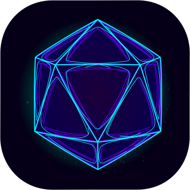

# Vessl IDE



A high-performance, IDE built in Odin using SDL3 for windowing/input and Clay for UI layout.

## Building and Running

### Prerequisites

1. **Odin Compiler**: Install from https://odin-lang.org/
   - Verify installation: `odin version`

2. **SDL3 and SDL3_ttf**: Required for windowing, input, and text rendering.
   - On macOS: `brew install sdl3 sdl3_ttf`
   - On Linux (Debian/Ubuntu): Build from source or use a PPA - SDL3 is not yet in standard repositories
   - On Windows: Download SDL3 and SDL3_ttf from https://github.com/libsdl-org/SDL/releases and https://github.com/libsdl-org/SDL_ttf/releases

### Build Command

```bash
# Build the project
odin build src -out:vessl

# Or build and run in one command
odin run src
```

## Plugins

Plugins are first-class citizens in the Vessl. You can write plugins
in any language you like if it compiles to WebAssembly. You can also
write plugins in Lua 5.4.

For the API documentation, see [PLUGIN_API.md](PLUGIN_API.md).
Examples/templates will be added soon.

You are free to distribute your plugins under any license you wish.
Plugins are not affected by the viral nature of the AGPL license.

## License

This program is free software: you can redistribute it and/or modify
it under the terms of the GNU Affero General Public License as
published by the Free Software Foundation, either version 3 of the
License, or (at your option) any later version.

This program is distributed in the hope that it will be useful,
but WITHOUT ANY WARRANTY; without even the implied warranty of
MERCHANTABILITY or FITNESS FOR A PARTICULAR PURPOSE.  See the
GNU Affero General Public License for more details.

You should have received a copy of the GNU Affero General Public License
along with this program.  If not, see <https://www.gnu.org/licenses/>.
